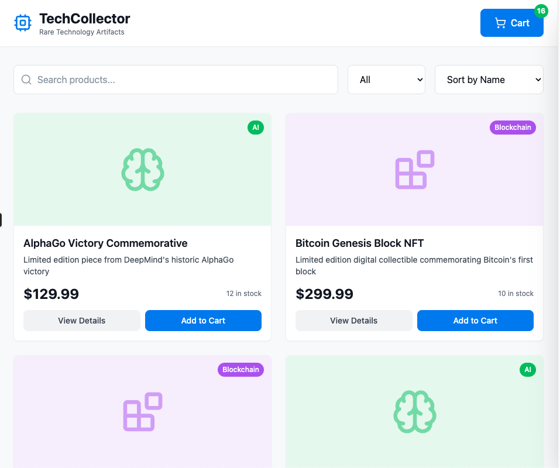
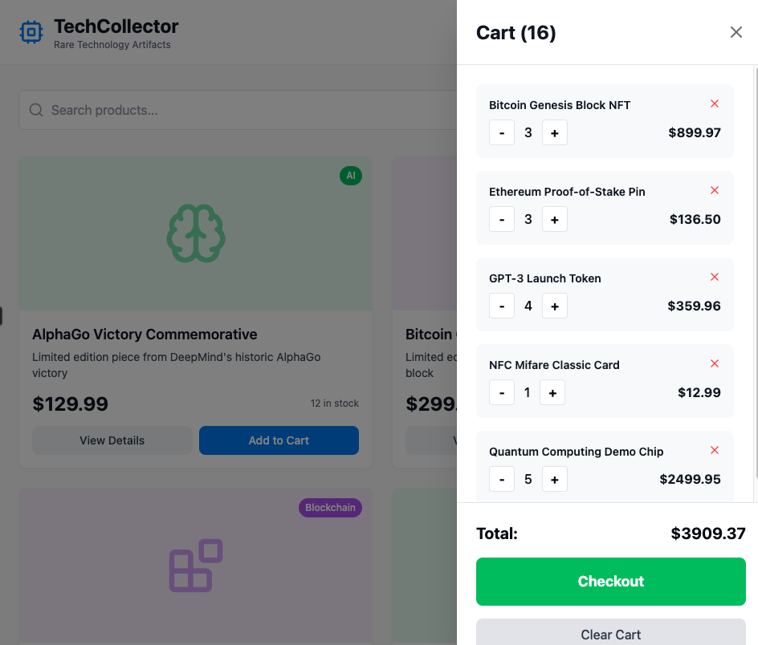

# Redux-shop

Dummy e-shop demonstrating Redux

<table>
  <tr>
    <td></td>
    <td></td>
  </tr>
  <tr>
    <td align="center">Product Catalog</td>
    <td align="center">Shopping Cart</td>
  </tr>
</table>


## Setup steps
### Git initialization

```
git init
git remote add origin https://github.com/vpcom/redux-shop.git
git remote set-url origin https://github.com/vpcom/redux-shop.git
git remote -v
```

### Install dependencies

```
npm install redux @reduxjs/toolkit react-redux react-router-dom axios
npm install --save-dev eslint prettier
npm install redux-persist
npm install lucide-react
```